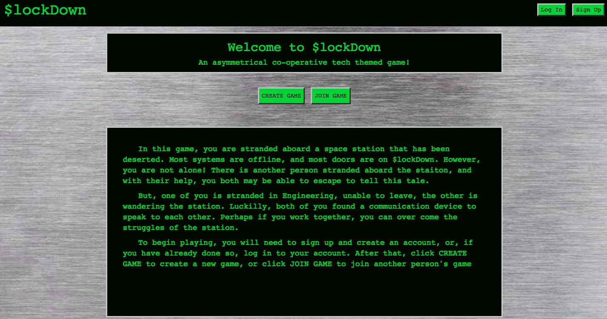
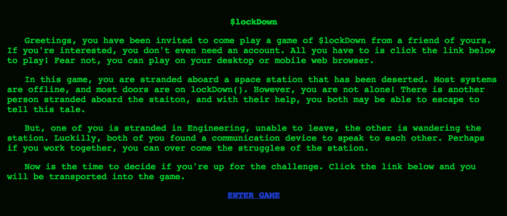
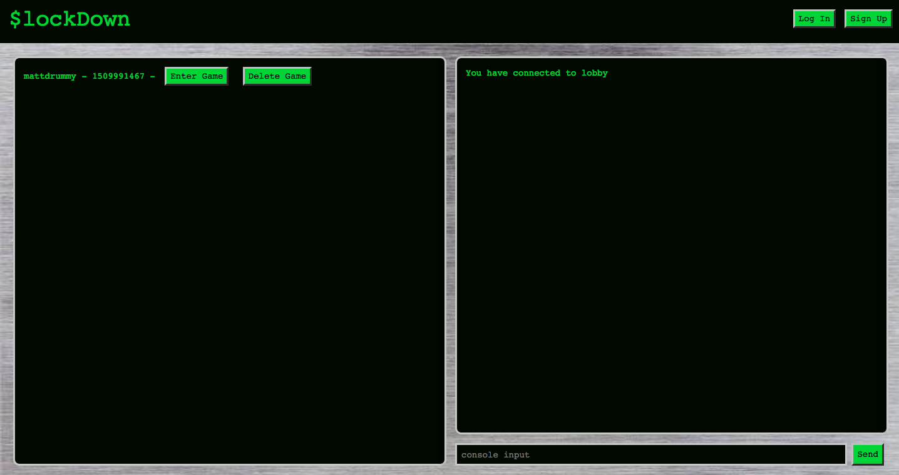
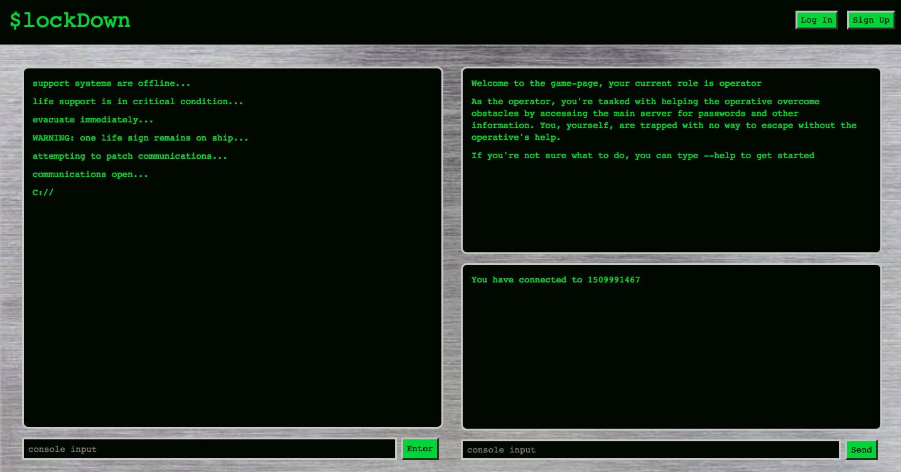

# $lockDown

Welcome to $lockDown.  An asymmetrical co-operative tech-themed game.

In this game, you are stranded aboard a space station that has been deserted. Most systems are offline, and most doors are on $lockDown. However, you are not alone! There is another person stranded aboard the staiton, and with their help, you both may be able to escape to tell this tale.

But, one of you is stranded in Engineering, unable to leave, the other is wandering the station. Luckilly, both of you found a communication device to speak to each other. Perhaps if you work together, you can over come the struggles of the station.

After you sign-up with an account you can click CREATE GAME to create a new game.  If you choose you may send an email invite to the player of your choice.  If you do, they will receive an email like this:

If not, you can click JOIN GAME to enter a lobby of other players to find another player to join your game:

Once in the game, you will be greeted by a game screen where you can work together with another player to get past an obstacle utilizing a command console and a chat box.

## Technology

* [Ember](https://www.emberjs.com/)
* [Go-lang](https://golang.org/)
* [Gin / Go](https://github.com/gin-gonic/gin)
* [Websockets / Ember](https://github.com/thoov/ember-websockets)
* [Socket.io / Go-lang](https://github.com/googollee/go-socket.io)
* [JWT / Go](https://github.com/dgrijalva/jwt-go)
* [Gmail / Go](https://godoc.org/google.golang.org/api/gmail/v1)
* [Crypto / Go](https://golang.org/pkg/crypto/)
* [Handlebars / Ember](http://handlebarsjs.com/)
* [MongoDB / mgo / Go](https://labix.org/mgo)
* [Bootstrap / Ember](http://www.ember-bootstrap.com/)

## Prerequisites

You will need the following things properly installed on your computer.

* [Git](https://git-scm.com/)
* [Node.js](https://nodejs.org/) (with NPM)
* [Ember CLI](https://ember-cli.com/)
* [Google Chrome](https://google.com/chrome/)

## Installation

* `git clone <repository-url>` this repository
* `cd lock-down-client`
* `npm install`

## Running / Development

* `ember serve`
* Visit your app at [http://localhost:4200](http://localhost:4200).

### Code Generators

Make use of the many generators for code, try `ember help generate` for more details

### Running Tests

* `ember test`
* `ember test --server`

### Building

* `ember build` (development)
* `ember build --environment production` (production)

### Deploying

Specify what it takes to deploy your app.

## Further Reading / Useful Links

* [ember.js](https://emberjs.com/)
* [ember-cli](https://ember-cli.com/)
* Development Browser Extensions
  * [ember inspector for chrome](https://chrome.google.com/webstore/detail/ember-inspector/bmdblncegkenkacieihfhpjfppoconhi)
  * [ember inspector for firefox](https://addons.mozilla.org/en-US/firefox/addon/ember-inspector/)
